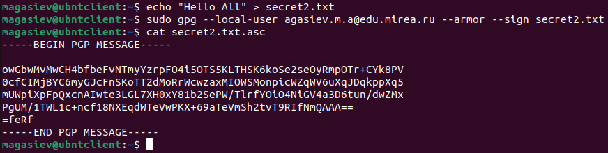

# Лабораторная работа №4. Настройка и применение криптографических протоколов

## Создание ключевой пары GPG

## Просмотр созданных ключей, подписей, отпечатков

## Создание отзывающего сертификата

Запись сертификата в файл

Просмотр содержимого файла

## Экспорт публичного ключа в бинарном и текстовом виде

## Создание файла для подписи

## Создание цифровой подписи в бинарном виде

## Проверка подписи

## Создание цифровой подписи в формате ASCII

## Создание цифровой подписи, вставленной в содержимое файла

