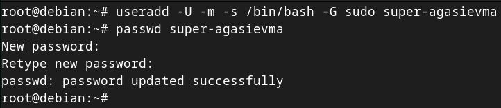
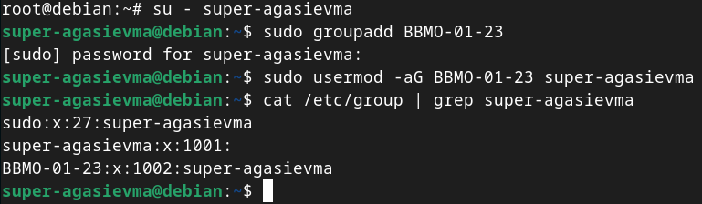
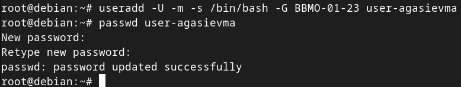
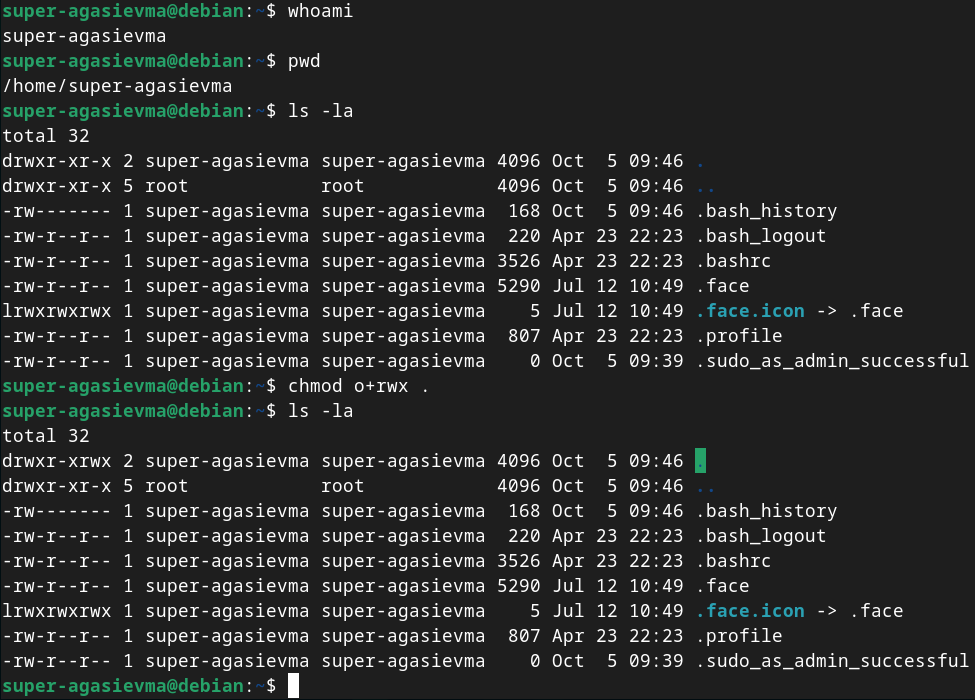
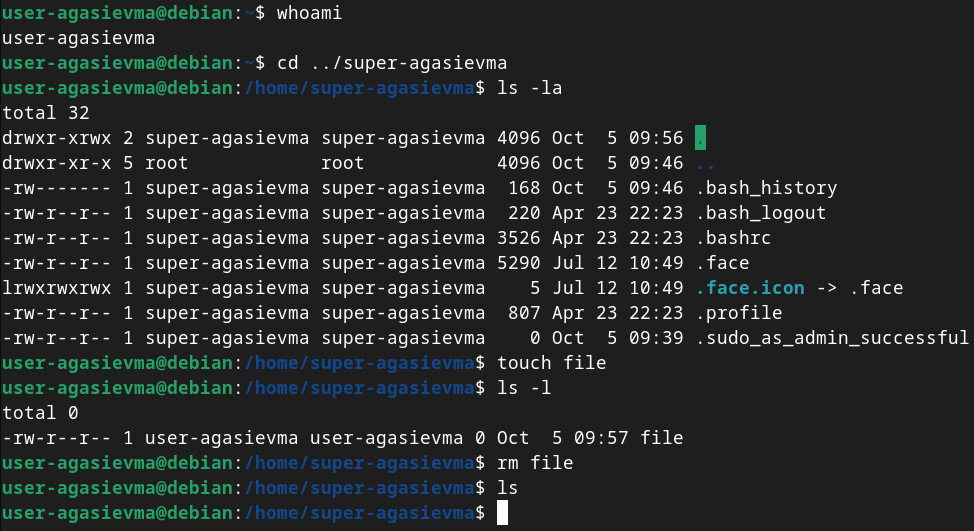

# Практическое задание 2

## Создание суперпользователя

## Создание группы `BBMO-01-23` и добавление суперпользователя в нее

## Создание пользователя с добавлением в ранее созданную группу

## Наделение полномочиями пользователя по созданию и удалению файлов в домашнем каталоге суперпользователя

## Проверка работы новых полномочий у пользователя

