# Практическое задание №3. Сбор логов

## `rsyslog`

### Установка `rsyslog` на сервер

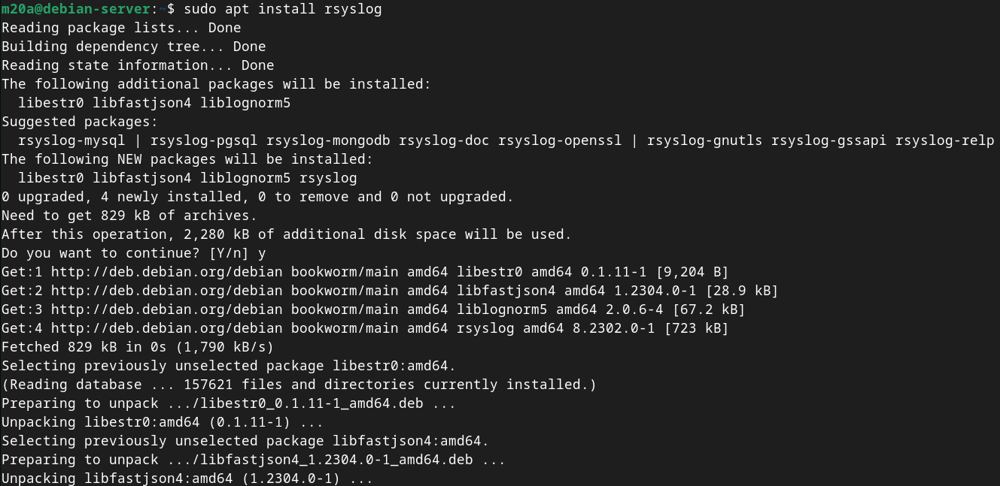

### Настройка модулей `rsyslog`

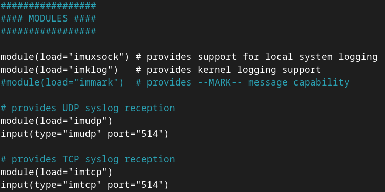

### Добавление правил сбора логов

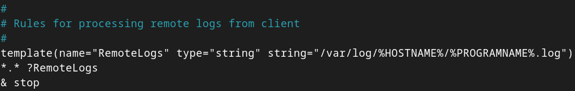

### Применение конфигурации `rsyslog` на сервере

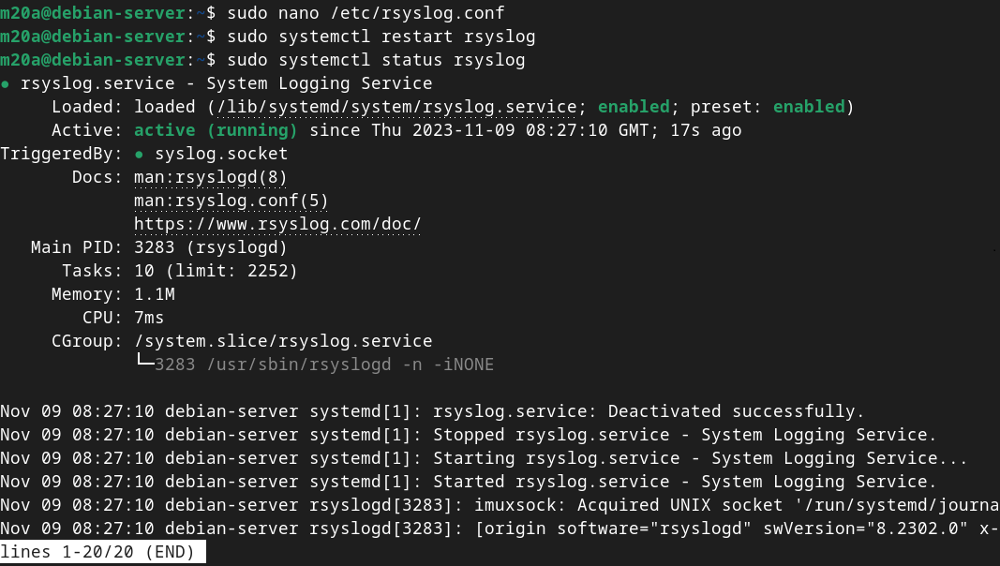

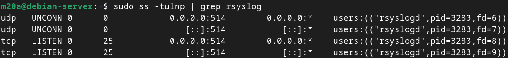

### Установка `rsyslog` на клиент

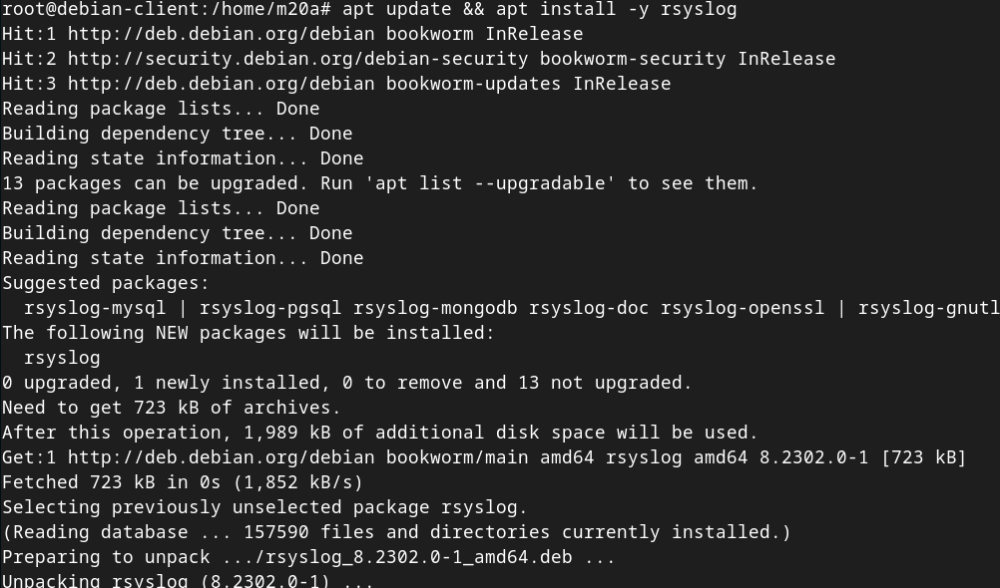

### Добавление правила пересылки логов на сервер

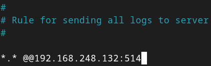

### Применение конфигурации `rsyslog` на клиенте

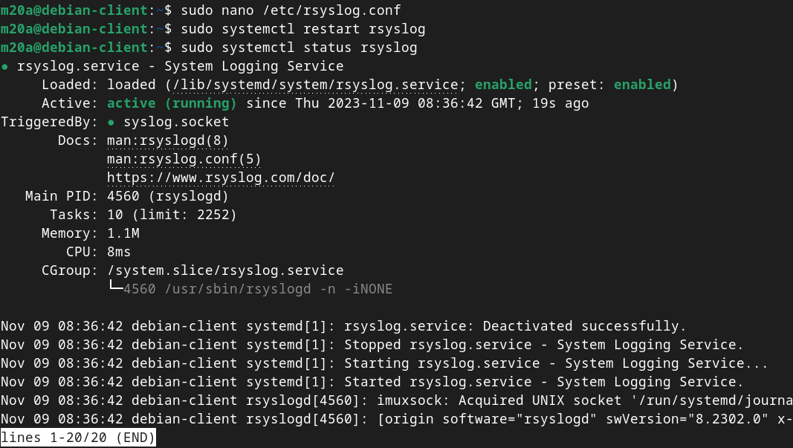

### Просмотр логов клиента на сервере

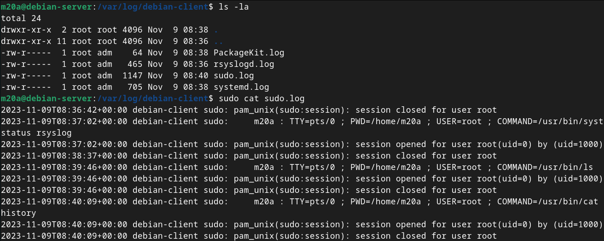

## Grafana Loki

### Загрузка compose-файла Loki

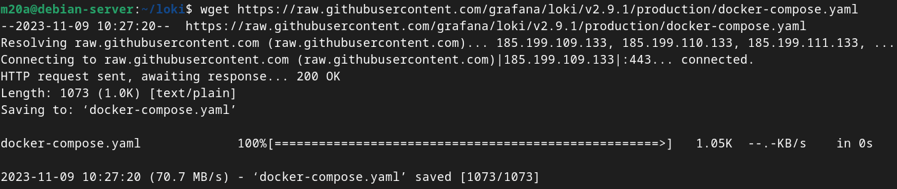

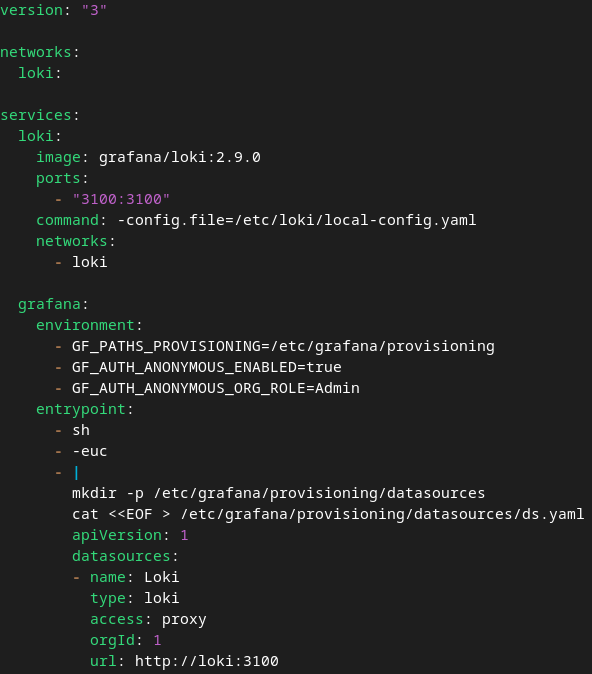

### Запуск Loki

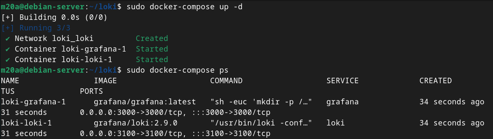

### Файл конфигурации `promtail` на клиенте

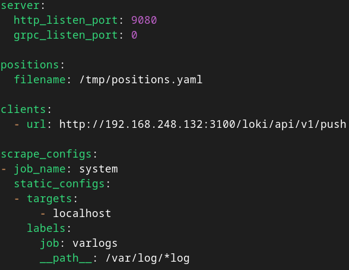

### Сompose-файл `promtail`

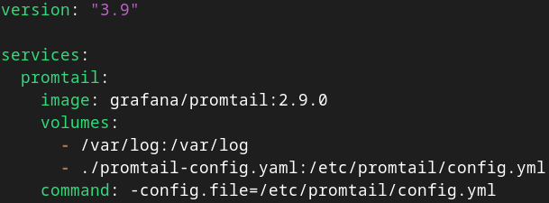

### Запуск `promtail` на клиенте

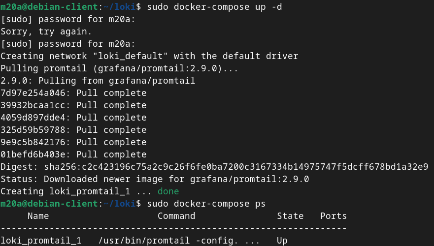

### Просмотр логов клиента в Grafana

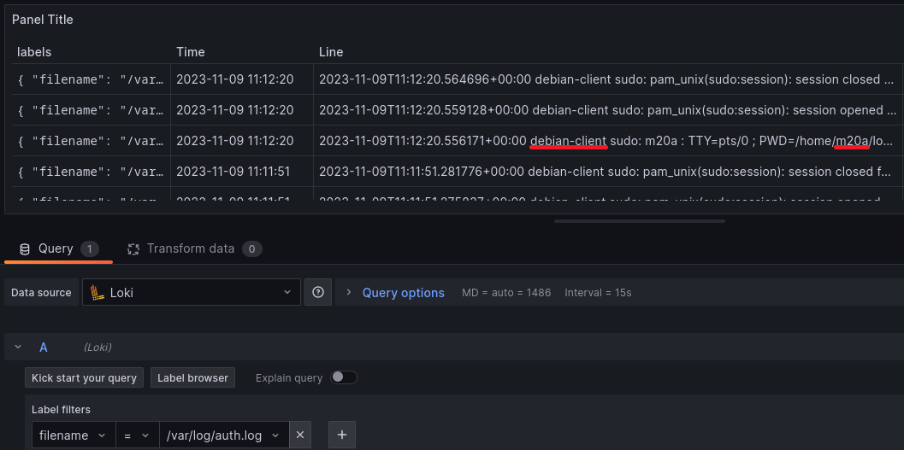

## Signoz

### Запуск Signoz

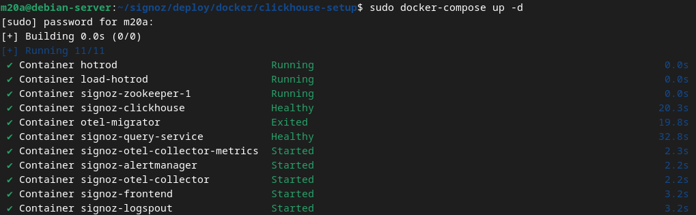

### Стартовая страница Signoz

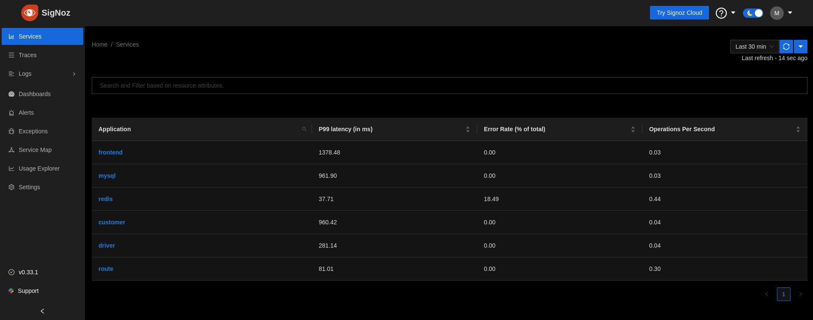

### Используемое приложения на клиенте для отправки данных в Signoz - https://github.com/SigNoz/sample-nodejs-app/

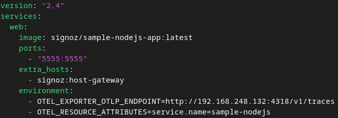

### Запуск клиентского приложения

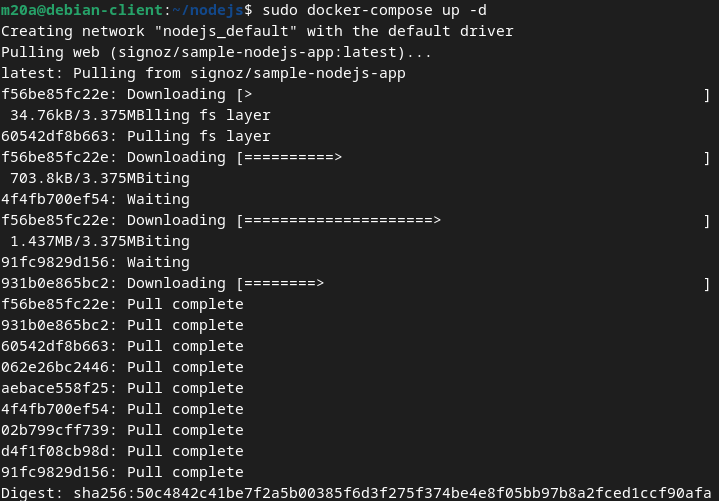

### Информационная панель в Signoz

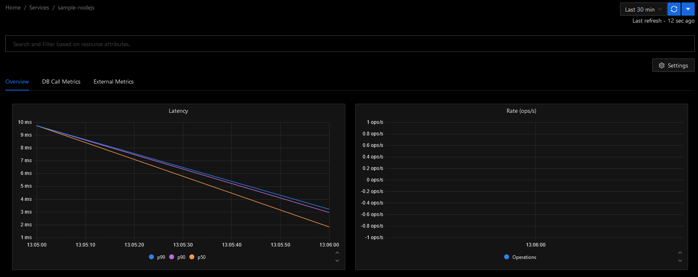
