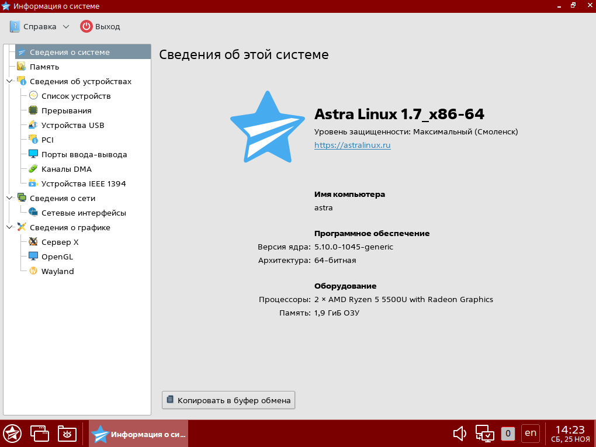
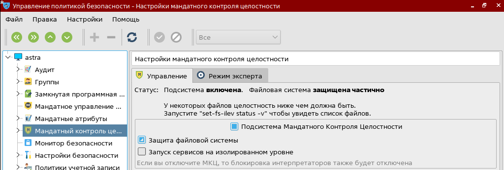
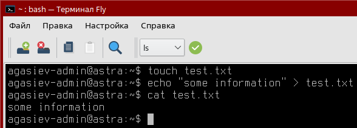
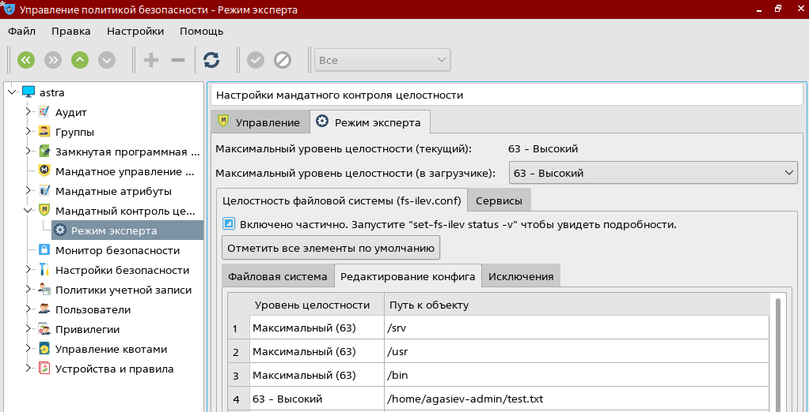
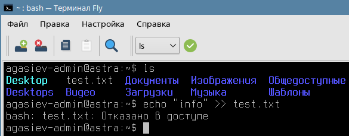
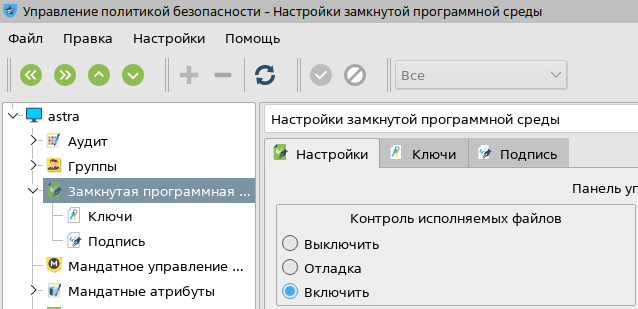
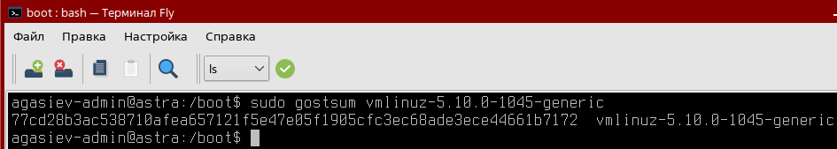
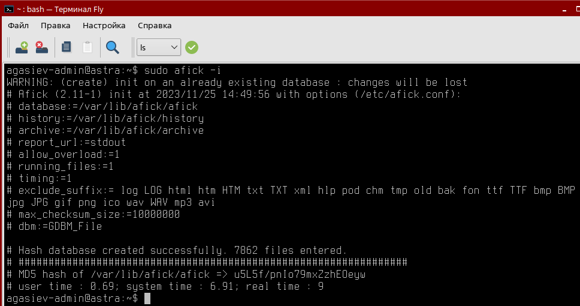
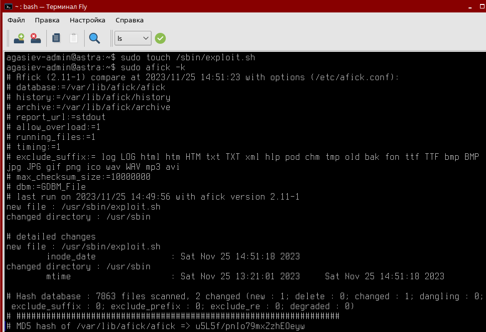

# Практическое задание №4. Контроль целостности

## Информация о развернутой ВМ с ОС Astra Linux

## Настройка и проверка работы мандатного контроля целостности

## Создание тестового файла, которому будет присвоена метка целостности

## Добавление метки созданному файлу

## Попытка записи в файл в сессии с низким уровнем целостности

## Настройка и проверка работы замкнутой программной среды

## Подсчёт контрольной суммы файла с помощью утилиты `gostsum`

## Инициализация `afick`

## Отслеживание изменений в файловой системы с помощью `afick`

