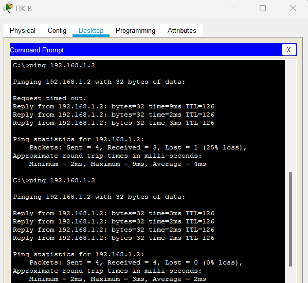

# Практическое задание №6. Настройка протокола GRE

## Определение IP-адреса порта S0/0/0 на маршрутизаторе RA

## Отправка эхо-запроса с RB на RA

## Определение IP-адреса на ПК А

## Отправка эхо-запроса с ПК B на ПК А до настройки туннеля GRE

## Настройка туннеля GRE на маршрутизаторе RA

## Настройка туннеля GRE на маршрутизаторе RB

## Настройка маршрута для частного трафика IP на маршрутизаторе RA

## Настройка маршрута для частного трафика IP на маршрутизаторе RB

## Отправка эхо-запроса с ПК B на ПК А после настройки GRE туннеля

## Трассировка от ПК А до ПК В

## Проверка успешности выполнения практической работы

